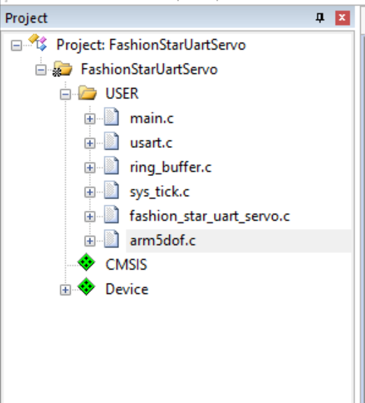
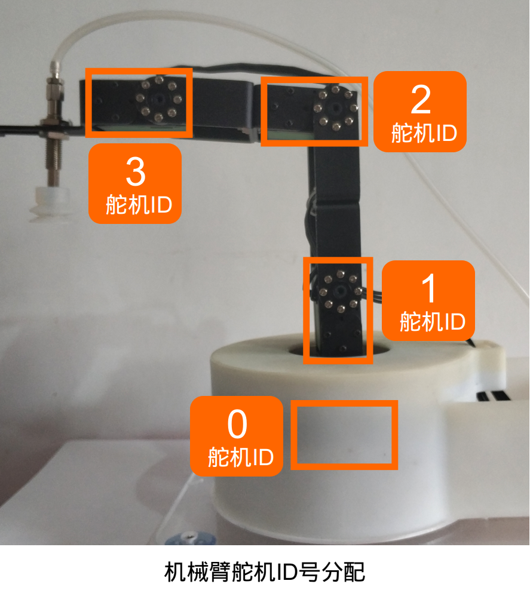
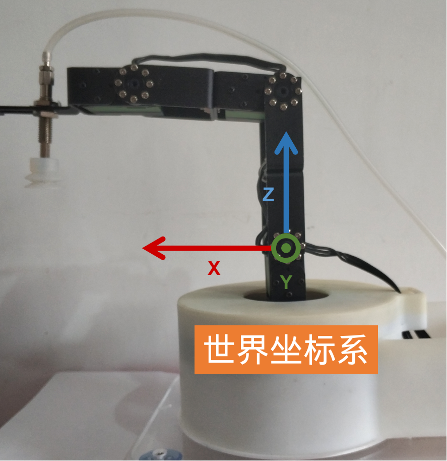
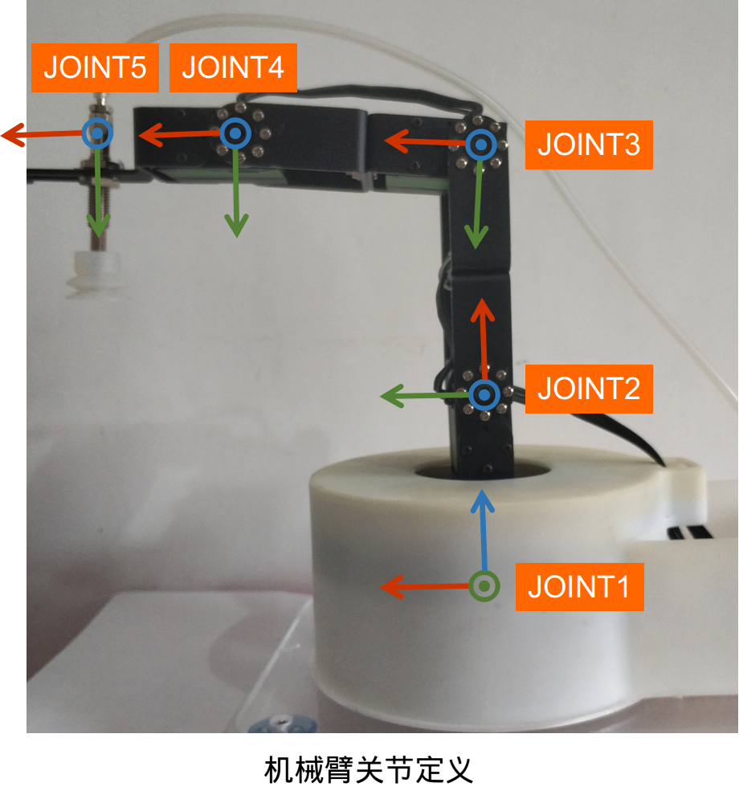
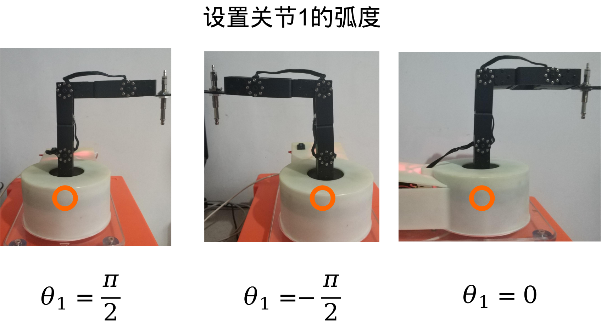
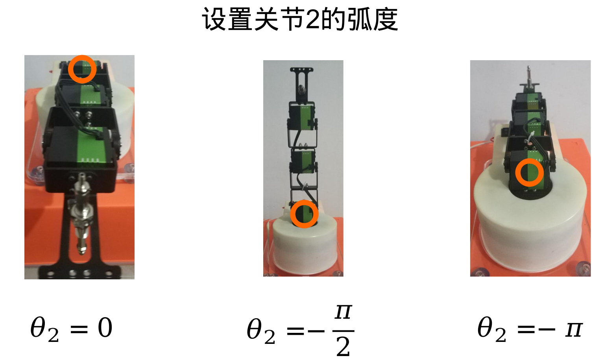
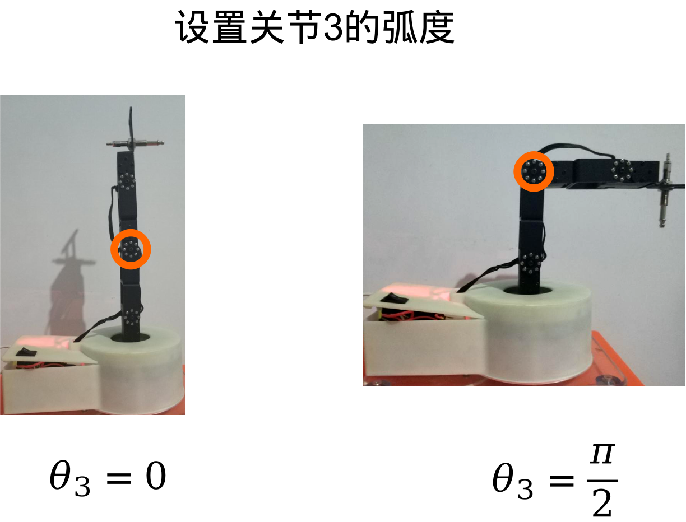
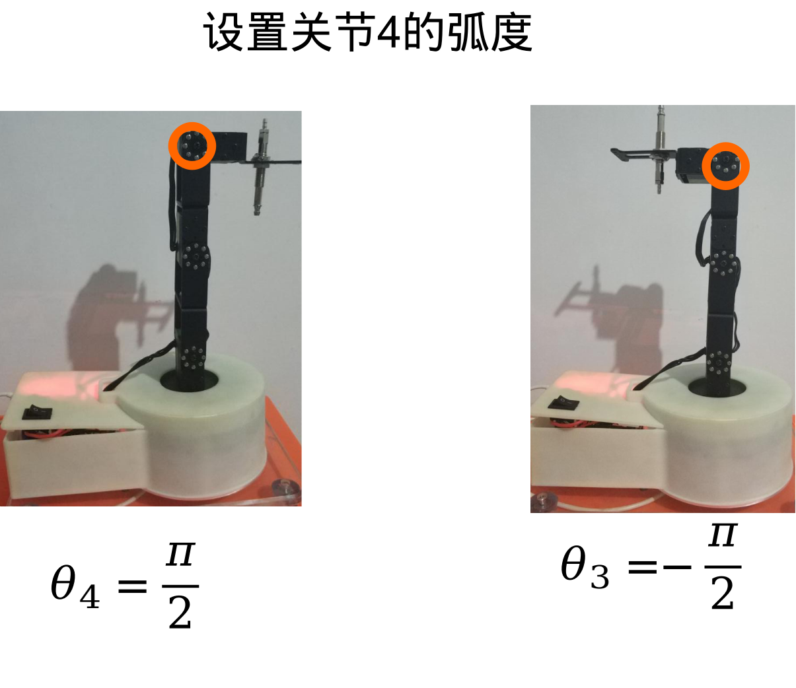
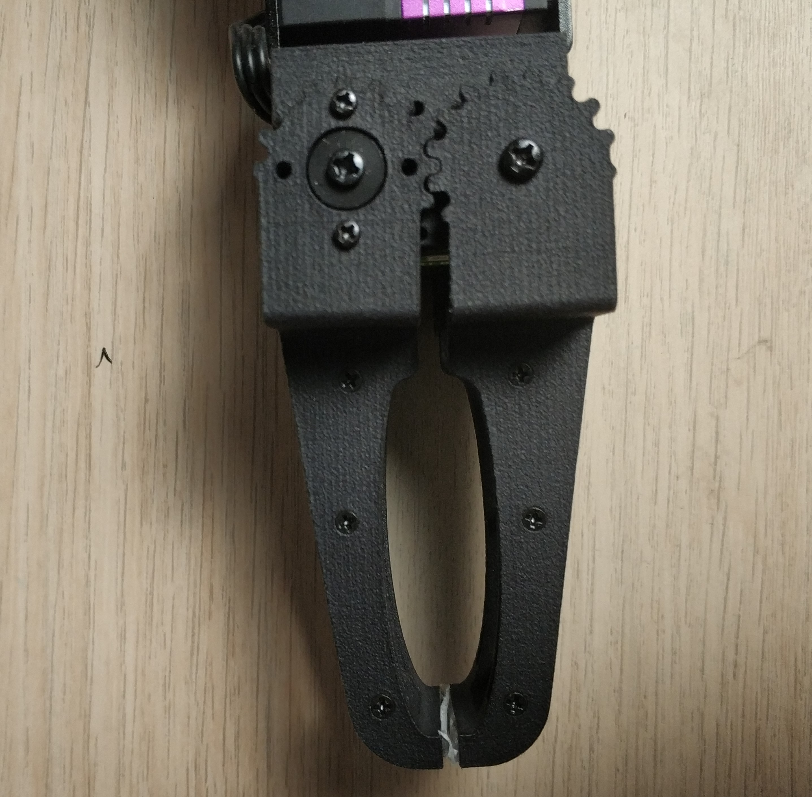
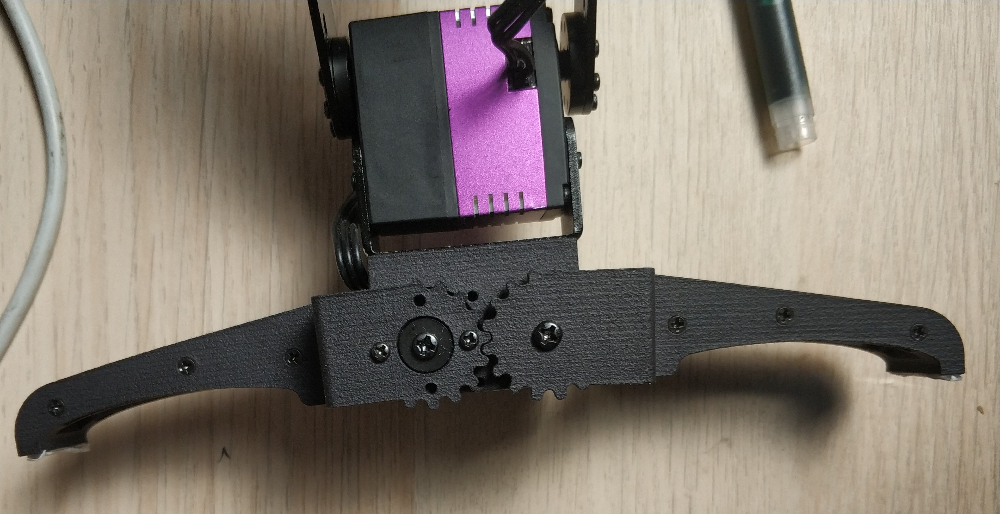

# FashionStar五自由度机械臂(STM32)使用说明


[toc]

## 开发环境配置

### 串口舵机调试工具

在FashionStar的官网，可以下载UART总线舵机的调试软件。

[FashionStar 舵机配套软件下载地址](https://fashionrobo.com/zh-hans/download/servo-software/)


软件包是一个`rar`后缀的压缩包，直接解压就可以，无需安装。


详情请参阅教程 *串口舵机使用入门 / 1.5舵机调试软件的使用*。　

**参阅教程给串口舵机分配ID**


### Keil5安装

Keil5是STM32的IDE，需要去Keil5的官方网站下载最新的IDE。

 [MDK-Arm官方下载地址](https://www.keil.com/download/product/)


安装好IDE之后，还需要安装STM32 F1系列的芯片包。

请自行搜索相关的视频/文本教程。


### STLinkV2驱动安装

STLink的驱动安装资料以及如何在Keil5中设置下载器选项，可以向销售STLinkV2的店家索要，并获取相关技术支持。


注：如果使用其他下载器也是可以的，并不局限于STLinkV2，只是因为这种下载器比较便宜，占用的管脚也比较少。


### USB转TTL驱动下载与安装

串口舵机转接板使用的USB转TTL串口芯片是`CH340`，需要在Windows上安装CH340的驱动。

[CH340驱动下载地址](http://www.wch.cn/download/CH341SER_EXE.html)

驱动安装完成之后，检查驱动是否安装成功。

[检查CH340驱动是否安装成功](https://jingyan.baidu.com/article/00a07f3872a90982d028dcb9.html)

另外, 你需要安装你所使用的USB转TTL的驱动（例如CP2102）。


 

### 串口调试助手

串口调试助手，推荐使用正点原子开发的XCOM V2.2。

[XCOM V2.2下载地址](https://www.amobbs.com/forum.php?mod=attachment&aid=NDQxNzc5fDE5NzMzYjQ1fDE1NzY2NTQ4NTN8MHw1NzAzODMz)（直接下载，无需注册）

[XCOM V2.2功能介绍](https://www.amobbs.com/thread-5703833-1-1.html)


## 工程结构

### 文件夹

打开文件夹 *src/FashionStarUartServo*

目录结构如下: 

* `Project` 

  Keil5的工程文件，点击 `FashionStarUartServo.uvprojx`   即可**通过Keil5, 双击打开此工程文件**。

* `User`

  主程序以及用户自定义库

  * `main.c` 用户主程序
  * 用户自定义的库文件，例如*串口舵机驱动库*

* `Listings` ：该目录是MDK生成信息输出目录，存放代码分布（.map和.lst）

* `Output` 该目录是MDK生成信息输出目录，存放目标文件(.o)、调试文件(.axf)、下载文件(.hex)、依赖文件（.d）等。

### 用户自定义库文件




User文件夹 工程结构介绍

* `sys_tick` 

  管理系统时间。通过配置系统定时器中断，实现了延时以及倒计时的逻辑。

* `ring_buffer` 

  用C语言实现了环形缓冲队列。用于存放管理串口通信的字节流。同时还具备向缓冲队列读取/写入特定数据类型的数值的功能。

* `usart`

  串口通信的库。通过配置宏，可以方便的打开关闭STM32F103C8开发板上三个USART资源。

* `fashion_star_uart_servo` 

  封装了Fashion Star 串口舵机的通信协议，是串口舵机STM32F103版本的SDK。

* `arm5dof.c`

  五自由度舵机SDK

* `main.c`

  主程序,程序入口。测试例程都放在这个文件中, 测试的时候取消注释对应的部分.


## 接线说明


### STM32与STLinkV2的接线

通过STLinkV2给STM32下载固件。

*STM32与STLinkV2的接线图*

| STM32       | STLinkV2 |
| ----------- | -------- |
| SWIO / IO   | SWDIO    |
| SWCLK / CLK | SWCLK    |
| GND         | GND      |
| 3V3         | 3.3v     |


### 串口资源


STM32F103一共有三个串口资源，分别为UART1、UART2、UART3。在舵机云台主题课程（STM32版）里，约定三个串口的用途分别为如下所示：

* `UART1` 接串口舵机转接板，控制串口舵机
* `UART2` 接USB转TTL模块，用于日志输出
* `UART3` 空闲未使用

### STM32与串口总线舵机的接线

串口1和串口舵机转接板的TTL接口相连，用于控制串口舵机。

*STM32与串口舵机转接板接线图*

| STM32F103 GPIO    | 串口舵机转接板 |
| ----------------- | -------------- |
| PA_9   (UART1 Tx) | Rx             |
| PA_10 (UART1 Rx)  | Tx             |
| 5v                | 5v             |
| GND               | GND            |


### STM32与USB转TTL模块

STM32的串口2与USB转TTL模块模块相连，给PC发送日志信息。

*STM32与USB转TTL接线图*

| STM32F103 GPIO  | USB转TTL模块 |
| --------------- | ------------ |
| PA_2 (UART2 Tx) | Rx           |
| PA_3 (UART2 Rx) | Tx           |
| GND             | GND          |

USB转TTL模块的USB口与电脑的USB口相连。


## 机械臂初始化 InitArm


### 简介

机械臂初始化，让机械臂回归到机械零点的位置.

### API讲解

导入依赖的库文件

```c
#include "stm32f10x.h"
#include "usart.h" // 串口通信
#include "sys_tick.h" // 系统时间管理
#include "fashion_star_uart_servo.h" // 舵机驱动库
#include "arm5dof.h" // 五自由度舵机SDK
```

创建一个Usart结构体, `usart1` 用于跟串口总线舵机进行通信.

```c
// 使用串口1作为舵机控制的端口
// <接线说明>
// STM32F103 PA9(Tx)  <----> 串口舵机转接板 Rx
// STM32F103 PA10(Rx) <----> 串口舵机转接板 Tx
// STM32F103 GND 	  <----> 串口舵机转接板 GND
// STM32F103 V5 	  <----> 串口舵机转接板 5V
// <注意事项>
// 使用前确保已设置usart.h里面的USART1_ENABLE为1
// 设置完成之后, 将下行取消注释
Usart_DataTypeDef* servoUsart = &usart1;
```

硬件资源初始化

```c
SysTick_Init(); 			// 嘀嗒定时器初始化
Usart_Init(); 				// 串口初始化
FSARM_Init(servoUsart); 	// 机械臂初始化-> 回归到机械零点
```


注: 如果想要修改机械臂机械零点的位置, 需要修改`arm5dof.h`里面的相关宏定义。

```c
// HOME 机械臂机械零点的定义
#define FSARM_HOME_X 13.5
#define FSARM_HOME_Y 0
#define FSARM_HOME_Z 6.4
#define FSARM_HOME_PITCH 20.0
```


### 例程源码-机械臂初始化测试

```c
/*
 * FashionStar五自由度机械臂-初始化测试
 * --------------------------
 * 作者: 阿凯|Kyle
 * 邮箱: xingshunkai@qq.com
 * 更新时间: 2020/05/26
 */
 
#include "stm32f10x.h"
#include "usart.h"
#include "sys_tick.h"
#include "fashion_star_uart_servo.h"
#include "arm5dof.h"

// 使用串口1作为舵机控制的端口
// <接线说明>
// STM32F103 PA9(Tx)  <----> 串口舵机转接板 Rx
// STM32F103 PA10(Rx) <----> 串口舵机转接板 Tx
// STM32F103 GND 	  <----> 串口舵机转接板 GND
// STM32F103 V5 	  <----> 串口舵机转接板 5V
// <注意事项>
// 使用前确保已设置usart.h里面的USART1_ENABLE为1
// 设置完成之后, 将下行取消注释
Usart_DataTypeDef* servoUsart = &usart1; 

int main (void)
{
	
	SysTick_Init(); 			// 嘀嗒定时器初始化
	Usart_Init(); 				// 串口初始化
	FSARM_Init(servoUsart); 	// 机械臂初始化-> 回归到机械零点
	while (1){
	}
}
```


## 阻尼模式与角度回读 DampingAndAngleRead

### 简介

设置舵机为阻尼模式, 并不断的查询舵机的原始角度。用手掰舵机, 查看舵机原始角度的变化.

### API讲解

#### 阻尼模式`FSARM_SetDamping`

**<函数原型>**

```c
// 设置关节为阻尼模式
void FSARM_SetDamping(uint16_t power);
```

**<输入参数>**

* `power` 舵机的功率

  功率的数值越大，再旋转舵机的时候阻力也就越大.

**<返回参数>**

* 无

**<演示示例>**

```c
uint16_t power = 500; 		// 阻尼模式下的功率
FSARM_SetDamping(power);    // 设置舵机为阻尼模式
```


#### 读取舵机角度`FSARM_QueryServoAngle`

**<函数原型>**

```c
// 批量读取舵机原始角度
void FSARM_QueryServoAngle(FSARM_JOINTS_STATE_T* servoAngles);
```

**<输入参数>**

* `servoAngles` 舵机角度的指针, 数据类型为`FSARM_JOINTS_STATE_T`

  ```c
  // 关节状态
  typedef struct{
  	float theta1;
  	float theta2;
      float theta3;
      float theta4;
  	float gripper;
  }FSARM_JOINTS_STATE_T;
  
  ```

**<返回参数>**

* 无

**<演示示例>**

```c
FSARM_JOINTS_STATE_T servoAngles; // 舵机的角度
FSARM_QueryServoAngle(&servoAngles); // 查询舵机当前的角度		
// 打印日志
printf("[INFO] Servo Angles: [%.1f, %.1f, %.1f, %.1f, %.1f] \r\n", \
	servoAngles.theta1, servoAngles.theta2, servoAngles.theta3, servoAngles.theta4, servoAngles.gripper);
```


#### 读取关节角度`FSARM_QueryJointAngle`

**<函数原型>**

```c
// 批量读取关节的角度
void FSARM_QueryJointAngle(FSARM_JOINTS_STATE_T* jointAngles);
```

**<输入参数>**

* `jointAngles`关节角度的指针

**<返回参数>**

* 无

**<演示示例>**

```c
FSARM_JOINTS_STATE_T jointAngles; // 关节的角度
FSARM_QueryJointAngle(&jointAngles); // 查询当前关节的角度
printf("[INFO] Joint Angles: [%.1f, %.1f, %.1f, %.1f, %.1f] \r\n", \
			jointAngles.theta1, jointAngles.theta2, jointAngles.theta3, jointAngles.theta4, jointAngles.gripper);
		
```


### 例程源码-阻尼模式下的角度回读

```c
/*
 * FashionStar五自由度机械臂-阻尼模式下角度回读
 * --------------------------
 * 作者: 阿凯|Kyle
 * 邮箱: xingshunkai@qq.com
 * 更新时间: 2020/05/26
 */
 
#include "stm32f10x.h"
#include "usart.h"
#include "sys_tick.h"
#include "fashion_star_uart_servo.h"
#include "arm5dof.h"

// 使用串口1作为舵机控制的端口
// <接线说明>
// STM32F103 PA9(Tx)  <----> 串口舵机转接板 Rx
// STM32F103 PA10(Rx) <----> 串口舵机转接板 Tx
// STM32F103 GND 	  <----> 串口舵机转接板 GND
// STM32F103 V5 	  <----> 串口舵机转接板 5V
// <注意事项>
// 使用前确保已设置usart.h里面的USART1_ENABLE为1
// 设置完成之后, 将下行取消注释
Usart_DataTypeDef* servoUsart = &usart1; 

// 使用串口2作为日志输出的端口
// <接线说明>
// STM32F103 PA2(Tx) <----> USB转TTL Rx
// STM32F103 PA3(Rx) <----> USB转TTL Tx
// STM32F103 GND 	 <----> USB转TTL GND
// STM32F103 V5 	 <----> USB转TTL 5V (可选)
// <注意事项>
// 使用前确保已设置usart.h里面的USART2_ENABLE为1
Usart_DataTypeDef* loggingUsart = &usart2;

// 重定向c库函数printf到串口，重定向后可使用printf函数
int fputc(int ch, FILE *f)
{
	while((loggingUsart->pUSARTx->SR&0X40)==0){}
	/* 发送一个字节数据到串口 */
	USART_SendData(loggingUsart->pUSARTx, (uint8_t) ch);
	/* 等待发送完毕 */
	// while (USART_GetFlagStatus(USART1, USART_FLAG_TC) != SET);		
	return (ch);
}


int main (void)
{
	
	SysTick_Init(); 			// 嘀嗒定时器初始化
	Usart_Init(); 				// 串口初始化
	FSARM_Init(servoUsart); 	// 机械臂初始化-> 回归到机械零点
	uint16_t power = 500; 		// 阻尼模式下的功率
	FSARM_SetDamping(power);    // 设置舵机为阻尼模式
	
	FSARM_JOINTS_STATE_T servoAngles; // 舵机的角度
	FSARM_JOINTS_STATE_T jointAngles; // 关节的角度

	while (1){
		// 查询舵机当前的角度
		FSARM_QueryServoAngle(&servoAngles);		
		// 查询当前关节的角度
		FSARM_QueryJointAngle(&jointAngles);
		// 打印日志
		printf("[INFO] Servo Angles: [%.1f, %.1f, %.1f, %.1f, %.1f] \r\n", \
			servoAngles.theta1, servoAngles.theta2, servoAngles.theta3, servoAngles.theta4, servoAngles.gripper);
		printf("[INFO] Joint Angles: [%.1f, %.1f, %.1f, %.1f, %.1f] \r\n", \
			jointAngles.theta1, jointAngles.theta2, jointAngles.theta3, jointAngles.theta4, jointAngles.gripper);
		
		// 等待500ms
		SysTick_DelayMs(500);
	}
}

```


**<输出日志>***

```
[INFO] Servo Angles: [13.4, -41.2, -64.2, -40.9, 24.0] 
[INFO] Joint Angles: [-11.3, -132.1, 109.0, 36.8, 23.2] 
[INFO] Servo Angles: [34.7, -41.3, -64.8, -41.1, 24.2] 
[INFO] Joint Angles: [-32.5, -132.1, 109.7, 37.1, 23.4] 
[INFO] Servo Angles: [-24.0, -41.5, -64.3, -41.0, 37.3] 
[INFO] Joint Angles: [28.0, -132.3, 109.2, 36.9, 36.0] 
[INFO] Servo Angles: [-41.0, -41.0, -64.4, -41.0, 37.3] 
[INFO] Joint Angles: [44.7, -131.9, 109.3, 36.9, 36.0] 
[INFO] Servo Angles: [-41.0, -41.0, -64.5, -41.0, 37.3] 
[INFO] Joint Angles: [44.7, -131.9, 109.3, 36.9, 36.0] 
[INFO] Servo Angles: [-41.0, -41.0, -64.5, -41.0, 37.3] 
[INFO] Joint Angles: [44.7, -131.9, 109.4, 36.9, 36.0] 
```


## 机械臂标定

### 简介

通过[例程源码-阻尼模式下的角度回读](#例程源码-阻尼模式下的角度回读)，采集特定关节在特定角度下的原始舵机角度, 并同步修改`arm5dof.h` 里面的相关配置.

### 机械臂舵机ID分配

机械臂舵机ID分配如下: 



### 世界坐标系

机械臂的世界坐标系/机械臂基坐标系定义如下:




世界坐标系的原点定义在#1号舵机的转轴中心处, 机械臂正前方为X轴, 上方为Z轴, Y轴指向纸面朝外.

### 机械臂关节与关节坐标系定义

关节与关节坐标系定义如下图所示:
















爪子的角度定义:

爪子关节为0度的时候， 爪子闭合.



爪子关节为90度的时候,  爪子张开.




### 舵机原始角度数据采集

运行[例程源码-阻尼模式下的角度回读](#例程源码-阻尼模式下的角度回读), 在阻尼模式下，将机械臂的关节掰到指定的位置, 并读取此时**舵机的原始角度**, 记录下来.

将采集的数据同步修改到`arm5dof.h`里面.

```c
// 舵机标定参数
#define FSARM_JOINT1_P90 -85.10  	//关节1为90°时的舵机原始角度
#define FSARM_JOINT1_N90 90.23   	//关节1为-90°时的舵机原始角度
#define FSARM_JOINT2_P0  90.80   	//关节2为0°时的舵机原始角度
#define FSARM_JOINT2_N90 0.90    	//关节2为-90°时的舵机原始角度
#define FSARM_JOINT3_P90 -45.5   	//关节3为90°时的舵机原始角度
#define FSARM_JOINT3_N90 130.90  	//关节3为-90°时的舵机原始角度
#define FSARM_JOINT4_P90 -93.4   	//关节4为90°时的舵机原始角度
#define FSARM_JOINT4_N90 84.3    	//关节4为-90°时的舵机原始角度
#define FSARM_GRIPPER_P0 -0.30		//爪子闭合的角度 关节角度为0
#define FSARM_GRIPPER_P90 93.80 	//爪子完全张开的角度 关节角度为90度 

```


## 设置关节角度 SetJointAngle

### 简介

控制机械臂的关节角度, 等待机械臂运动到特定的位置之后, 再执行后续的动作.

### API讲解


#### 设置关节角度`FSARM_SetJointAngle`

**<函数原型>**

```c
// 批量设置关节的角度
void FSARM_SetJointAngle(FSARM_JOINTS_STATE_T jointAngles);
```

**<输入参数>**

* `jointAngles` : 关节角度

  数据类型为`FSARM_JOINTS_STATE_T`结构体

**<返回参数>**

* 无

**<演示示例>**

```c
FSARM_JOINTS_STATE_T jointAngles; // 关节的角度
// 设置关节角度
jointAngles.theta1 = 45.0;
jointAngles.theta2 = -130.0;
jointAngles.theta3 = 90.0;
jointAngles.theta4 = 60.0;
jointAngles.gripper = 45.0; // 爪子的角度

// 设置关节角度
FSARM_SetJointAngle(jointAngles);
```


#### 设置关节角度(指定周期)`FSARM_SetJointAngle2`

**<函数原型>**

```c
// 批量设置关节的角度(带统一的周期)
void FSARM_SetJointAngle2(FSARM_JOINTS_STATE_T jointAngles, uint16_t interval);
```


**<输入参数>**

* `jointAngles` 关节角度
* `interval` 周期, 单位为ms

**<返回参数>**

* 无

**<演示示例>**

```c
FSARM_JOINTS_STATE_T jointAngles; // 关节的角度
// 设置关节角度
jointAngles.theta1 = 45.0;
jointAngles.theta2 = -130.0;
jointAngles.theta3 = 90.0;
jointAngles.theta4 = 60.0;
jointAngles.gripper = 45.0; // 爪子的角度

uint16_t interval = 1000; // 周期为1000ms
FSARM_SetJointAngle2(jointAngles, interval);
```


#### 等待关节旋转到目标位置`FSARM_WaitAll`

需要注意的是`FSARM_SetJointAngle`与函数`FSARM_SetJointAngle2` 并不是阻塞式的, 并不会等待舵机旋转到目标角度才会执行到下一条指令, 所以如果你想让机械臂执行完一个动作再去执行下一个动作的话, 就需要使用 `FSARM_WaitAll` 函数


**<函数原型>**

```c
// 等待所有的关节旋转到目标角度
void FSARM_WaitAll(void);
```

**<输入参数>**

* 无

**<返回参数>**

* 无

**<演示示例>**

```c
FSARM_WaitAll();
```


### 例程源码-设置关节角度

```c
/*
 * FashionStar五自由度机械臂-设置关节角度
 * --------------------------
 * 作者: 阿凯|Kyle
 * 邮箱: xingshunkai@qq.com
 * 更新时间: 2020/05/26
 */
 
#include "stm32f10x.h"
#include "usart.h"
#include "sys_tick.h"
#include "fashion_star_uart_servo.h"
#include "arm5dof.h"

// 使用串口1作为舵机控制的端口
// <接线说明>
// STM32F103 PA9(Tx)  <----> 串口舵机转接板 Rx
// STM32F103 PA10(Rx) <----> 串口舵机转接板 Tx
// STM32F103 GND 	  <----> 串口舵机转接板 GND
// STM32F103 V5 	  <----> 串口舵机转接板 5V
// <注意事项>
// 使用前确保已设置usart.h里面的USART1_ENABLE为1
// 设置完成之后, 将下行取消注释
Usart_DataTypeDef* servoUsart = &usart1; 


int main (void)
{
	
	SysTick_Init(); 			// 嘀嗒定时器初始化
	Usart_Init(); 				// 串口初始化
	FSARM_Init(servoUsart); 	// 机械臂初始化-> 回归到机械零点
			
	FSARM_JOINTS_STATE_T jointAngles; // 关节的角度
	
	while (1){
		// 动作A
		// 设置关节角度
		jointAngles.theta1 = 45.0;
		jointAngles.theta2 = -130.0;
		jointAngles.theta3 = 90.0;
		jointAngles.theta4 = 60.0;
		jointAngles.gripper = 45.0; // 爪子的角度
		
		// 设置关节角度
		FSARM_SetJointAngle(jointAngles);
		FSARM_WaitAll();
		SysTick_DelayMs(1000); // 等待1s
		
		// 动作B
		jointAngles.theta1 = 90.0;
		jointAngles.theta2 = -130.0;
		jointAngles.theta3 = 90.0;
		jointAngles.theta4 = 60.0;
		jointAngles.gripper = 0.0; // 爪子的角度
		
		uint16_t interval = 1000; // 周期为2000ms
		FSARM_SetJointAngle2(jointAngles, interval);
		FSARM_WaitAll();
		SysTick_DelayMs(1000); // 等待1s
	}
}
```


## 机械臂正向运动学 ForwardKinematics


### 简介

正向运动学就是在已知关节角度的前提下求解机械臂末端在机械臂基坐标系下的位置/位姿.

### API讲解

#### 机械臂正向运动学`FSARM_ForwardKinmatics`

**<函数原型>**

```c
// 机械臂的正向运动学
void FSARM_ForwardKinmatics(FSARM_JOINTS_STATE_T jointAngles, FSARM_POINT3D_T* toolPosi, float* pitch);
```

**<输入参数>**

* `jointAngles` 关节角度

* `toolPosi` 末端坐标的指针, 数据类型为`FSARM_POINT3D_T`

  ```c
  // 笛卡尔空间下的点
  typedef struct{
      float x;
      float y;
      float z;
  }FSARM_POINT3D_T;
  
  ```

* `pitch` 末端的俯仰角


**<返回参数>**

* 无

**演示示例**

```c
FSARM_JOINTS_STATE_T jointAngles; // 关节的角度
FSARM_POINT3D_T  toolPosi; 		  // 工具坐标系的坐标

// 设置关节角度
jointAngles.theta1 = 45.0;
jointAngles.theta2 = -130.0;
jointAngles.theta3 = 90.0;
jointAngles.theta4 = 60.0;
jointAngles.gripper = 0.0;

// 测试正向运动学
FSARM_ForwardKinmatics(jointAngles, &toolPosi, &pitch);
// 打印当前末端的位置信息
printf("Forward Kinematics, ToolPosi = (%.1f, %.1f, %.1f) Pitch=%.1f", \
    toolPosi.x, toolPosi.y, toolPosi.z, pitch);
```


### 例程源码-机械臂正向运动学测试


```c
/*
 * FashionStar五自由度机械臂-机械臂正向运动学测试
 * --------------------------
 * 作者: 阿凯|Kyle
 * 邮箱: xingshunkai@qq.com
 * 更新时间: 2020/05/26
 */
 
#include "stm32f10x.h"
#include "usart.h"
#include "sys_tick.h"
#include "fashion_star_uart_servo.h"
#include "arm5dof.h"

// 使用串口1作为舵机控制的端口
// <接线说明>
// STM32F103 PA9(Tx)  <----> 串口舵机转接板 Rx
// STM32F103 PA10(Rx) <----> 串口舵机转接板 Tx
// STM32F103 GND 	  <----> 串口舵机转接板 GND
// STM32F103 V5 	  <----> 串口舵机转接板 5V
// <注意事项>
// 使用前确保已设置usart.h里面的USART1_ENABLE为1
// 设置完成之后, 将下行取消注释
Usart_DataTypeDef* servoUsart = &usart1; 
// 使用串口2作为日志输出的端口
// <接线说明>
// STM32F103 PA2(Tx) <----> USB转TTL Rx
// STM32F103 PA3(Rx) <----> USB转TTL Tx
// STM32F103 GND 	 <----> USB转TTL GND
// STM32F103 V5 	 <----> USB转TTL 5V (可选)
// <注意事项>
// 使用前确保已设置usart.h里面的USART2_ENABLE为1
Usart_DataTypeDef* loggingUsart = &usart2;

// 重定向c库函数printf到串口，重定向后可使用printf函数
int fputc(int ch, FILE *f)
{
	while((loggingUsart->pUSARTx->SR&0X40)==0){}
	/* 发送一个字节数据到串口 */
	USART_SendData(loggingUsart->pUSARTx, (uint8_t) ch);
	/* 等待发送完毕 */
	// while (USART_GetFlagStatus(USART1, USART_FLAG_TC) != SET);		
	return (ch);
}


int main (void)
{
	
	SysTick_Init(); 			// 嘀嗒定时器初始化
	Usart_Init(); 				// 串口初始化
	FSARM_Init(servoUsart); 	// 机械臂初始化-> 回归到机械零点
			
	FSARM_JOINTS_STATE_T jointAngles; // 关节的角度
	FSARM_POINT3D_T  toolPosi; 		  // 工具坐标系的坐标
	float pitch; 					  // 末端的俯仰角
	
	// 设置关节角度
	jointAngles.theta1 = 45.0;
    jointAngles.theta2 = -130.0;
    jointAngles.theta3 = 90.0;
    jointAngles.theta4 = 60.0;
    jointAngles.gripper = 0.0;
	
	// 设置关节角度
	FSARM_SetJointAngle(jointAngles);
	FSARM_WaitAll();	
	SysTick_DelayMs(1000); // 等待1s
	
	// 测试正向运动学
	FSARM_ForwardKinmatics(jointAngles, &toolPosi, &pitch);
	// 打印当前末端的位置信息
	printf("Forward Kinematics, ToolPosi = (%.1f, %.1f, %.1f) Pitch=%.1f", \
		toolPosi.x, toolPosi.y, toolPosi.z, pitch);
	
	while (1){
	}
}
```

*<日志输出>*

```
Forward Kinematics, ToolPosi = (10.1, 10.1, 6.4) Pitch=20.0
```


## 机械臂逆向运动学 InverseKinematics

### 简介

机械臂逆向运动学是指,给定工具在世界坐标系下的位姿, 求解此时关节的角度.

### API讲解

#### 机械臂逆向运动学`FSARM_InverseKinematics`

**<函数原型>**

```c
// 机械臂逆向运动学
FSARM_STATUS  FSARM_InverseKinematics(FSARM_POINT3D_T toolPosi, float pitch, FSARM_JOINTS_STATE_T* jointAngles);

```

**<输入参数>**

* `toolPosi`工具坐标
* `pitch` 末端的俯仰角
* `jointAngles` 关节角度的指针

**<返回参数>**

* 状态码`FSARM_STATUS`

  通过状态码可以知道逆向运动学求解是否成功,  如果失败则可以查看到底是哪个关节超出范围. 状态码的定义如下:

  ```c
  // 状态码
  #define FSARM_STATUS uint8_t
  #define FSARM_STATUS_SUCCESS 0 // 成功
  #define FSARM_STATUS_FAIL 1 // 失败
  #define FSARM_STATUS_JOINT1_OUTRANGE 2 // 关节1超出范围
  #define FSARM_STATUS_JOINT2_OUTRANGE 3 // 关节2超出范围
  #define FSARM_STATUS_JOINT3_OUTRANGE 4 // 关节3超出范围
  #define FSARM_STATUS_JOINT4_OUTRANGE 5 // 关节4超出范围
  #define FSARM_STATUS_TOOLPOSI_TOO_FAR 6 // 工具坐标目标点距离机械臂太遥远
  ```

**<演示示例>**

```c
FSARM_POINT3D_T toolPosi; // 末端位置
FSARM_JOINTS_STATE_T jointAngles; // 关节角度-逆向运动学输出的结果
// 设置末端的坐标
toolPosi.x = 10.0;
toolPosi.y = 0.0;
toolPosi.z = -3.0;
pitch = 20.0;
// 机械臂逆向运动学
FSARM_STATUS status = FSARM_InverseKinematics(toolPosi, pitch, &jointAngles);
```

### 例程源码-机械臂逆向运动学测试

```c
/*
 * FashionStar五自由度机械臂-机械臂逆向运动学测试
 * --------------------------
 * 作者: 阿凯|Kyle
 * 邮箱: xingshunkai@qq.com
 * 更新时间: 2020/05/27
 */
 
#include "stm32f10x.h"
#include "usart.h"
#include "sys_tick.h"
#include "fashion_star_uart_servo.h"
#include "arm5dof.h"

// 使用串口1作为舵机控制的端口
// <接线说明>
// STM32F103 PA9(Tx)  <----> 串口舵机转接板 Rx
// STM32F103 PA10(Rx) <----> 串口舵机转接板 Tx
// STM32F103 GND 	  <----> 串口舵机转接板 GND
// STM32F103 V5 	  <----> 串口舵机转接板 5V
// <注意事项>
// 使用前确保已设置usart.h里面的USART1_ENABLE为1
// 设置完成之后, 将下行取消注释
Usart_DataTypeDef* servoUsart = &usart1; 
// 使用串口2作为日志输出的端口
// <接线说明>
// STM32F103 PA2(Tx) <----> USB转TTL Rx
// STM32F103 PA3(Rx) <----> USB转TTL Tx
// STM32F103 GND 	 <----> USB转TTL GND
// STM32F103 V5 	 <----> USB转TTL 5V (可选)
// <注意事项>
// 使用前确保已设置usart.h里面的USART2_ENABLE为1
Usart_DataTypeDef* loggingUsart = &usart2;

// 重定向c库函数printf到串口，重定向后可使用printf函数
int fputc(int ch, FILE *f)
{
	while((loggingUsart->pUSARTx->SR&0X40)==0){}
	/* 发送一个字节数据到串口 */
	USART_SendData(loggingUsart->pUSARTx, (uint8_t) ch);
	/* 等待发送完毕 */
	// while (USART_GetFlagStatus(USART1, USART_FLAG_TC) != SET);		
	return (ch);
}


int main (void)
{
	SysTick_Init(); 			// 嘀嗒定时器初始化
	Usart_Init(); 				// 串口初始化
	FSARM_Init(servoUsart); 	// 机械臂初始化-> 回归到机械零点
			
	FSARM_JOINTS_STATE_T jointAngles; // 关节的角度
	FSARM_POINT3D_T  toolPosi; 		  // 工具坐标系的坐标
	float pitch;
	
	// 设置关节角度
	jointAngles.theta1 = 45.0;
    jointAngles.theta2 = -130.0;
    jointAngles.theta3 = 90.0;
    jointAngles.theta4 = 60.0;
    jointAngles.gripper = 0.0;
	
	// 设置关节角度
	FSARM_SetJointAngle(jointAngles);
	FSARM_WaitAll();	
	SysTick_DelayMs(1000); // 等待1s
	
	// 机械臂正向运动学
	FSARM_ForwardKinmatics(jointAngles, &toolPosi, &pitch);
	// 打印当前末端的位置信息
	printf("Forward Kinematics, ToolPosi = (%.1f, %.1f, %.1f) Pitch = %.1f \r\n", toolPosi.x, toolPosi.y, toolPosi.z, pitch);
	
	// 关节角度2(存储逆向运动学的结果)
	FSARM_JOINTS_STATE_T jointAngles2;
	// 机械臂逆向运动
	FSARM_STATUS status = FSARM_InverseKinematics(toolPosi, pitch, &jointAngles2);
	// 打印逆向运动学的结果
	printf("Inverse Kinematics, result code = %d\r\n", status);
	printf("-> Joint Angles = (%.1f, %.1f, %.1f, %.1f) \r\n", jointAngles2.theta1, jointAngles2.theta2, jointAngles2.theta3, jointAngles2.theta4);
	
	while (1){
	}
}
```

*<日志输出>*

```
Forward Kinematics, ToolPosi = (10.1, 10.1, 6.4) Pitch = 20.0 
Inverse Kinematics, result code = 0
-> Joint Angles = (45.0, -125.7, 89.2, 56.4) 

```


## 自由轨迹 MoveP2P

### 简介

控制机械臂的末端移动到特定的位置, 中间不遵循特定的轨迹, 但是机械臂的末端保持与工作台平行。

### API讲解

#### 自由轨迹`FSARM_MoveP2P`

**<函数原型>**

```c
// 点控(自由轨迹)
FSARM_STATUS FSARM_MoveP2P(float x, float y, float z, float pitch);
```

**<输入参数>**

* `x` 末端的x坐标
* `y` 末端的y坐标
* `z` 末端的z坐标
* `pitch` 末端的俯仰角

**<返回参数>**

* 状态码`FSARM_STATUS`

  与[机械臂逆向运动学`FSARM_InverseKinematics`](#机械臂逆向运动学`FSARM_InverseKinematics`) 中的定义相同.

**<示例代码>**

```c
FSARM_MoveP2P(14.0, 0, -4.0, 55.0);
```


### 例程源码-点控MoveP2P(自由轨迹)


```c
/*
 * FashionStar五自由度机械臂-点控MoveP2P(自由轨迹)
 * --------------------------
 * 作者: 阿凯|Kyle
 * 邮箱: xingshunkai@qq.com
 * 更新时间: 2020/05/27
 */
 
#include "stm32f10x.h"
#include "usart.h"
#include "sys_tick.h"
#include "fashion_star_uart_servo.h"
#include "arm5dof.h"

// 使用串口1作为舵机控制的端口
// <接线说明>
// STM32F103 PA9(Tx)  <----> 串口舵机转接板 Rx
// STM32F103 PA10(Rx) <----> 串口舵机转接板 Tx
// STM32F103 GND 	  <----> 串口舵机转接板 GND
// STM32F103 V5 	  <----> 串口舵机转接板 5V
// <注意事项>
// 使用前确保已设置usart.h里面的USART1_ENABLE为1
// 设置完成之后, 将下行取消注释
Usart_DataTypeDef* servoUsart = &usart1; 

int main (void)
{
	SysTick_Init(); 			// 嘀嗒定时器初始化
	Usart_Init(); 				// 串口初始化
	FSARM_Init(servoUsart); 	// 机械臂初始化-> 回归到机械零点
			
	
	
	while (1){
		FSARM_MoveP2P(13.5, 0, 5, 25.0);
		FSARM_WaitAll();
		SysTick_DelayMs(1000); // 等待1s
		
		FSARM_MoveP2P(14.0, 0, -4.0, 55.0);
		FSARM_WaitAll();
		SysTick_DelayMs(1000); // 等待1s
		
		FSARM_MoveP2P(9.5, 9.5, -4.0, 55.0);
		FSARM_WaitAll();
		SysTick_DelayMs(1000); // 等待1s
	}
}
```


## 按键扫描与机械臂控制


## 按键与功能说明

按键事件一共有五种, 分别为

```c
#define KEY_EVENT_NONE 0 				// 无事件发生
#define KEY_EVENT_SINGLE_CLICK 1 		// 按键单击
#define KEY_EVENT_DOUBLE_CLICK 2 		// 按键双击
#define KEY_EVENT_LONG_PRESSED_START 3 	// 按键长按开始
#define KEY_EVENT_LONG_PRESSED_END  4	// 按键长按结束
```

**KEY1按键功能说明**

| 状态     | 功能说明            |
| -------- | ------------------- |
| 按键单击 | 切换当前的舵机ID +1 |
| 按键双击 |                     |
| 按键长按 |                     |

**KEY2按键功能说明**

| 状态     | 功能说明            |
| -------- | ------------------- |
| 按键单击 | 切换当前的舵机ID -1 |
| 按键双击 |                     |
| 按键长按 |                     |

**KEY3按键功能说明**

| 状态     | 功能说明                 |
| -------- | ------------------------ |
| 按键单击 | 当前舵机角度增加(小幅度) |
| 按键双击 | 当前舵机角度增加(大幅度) |
| 按键长按 | 当前舵机角度持续增加     |

**KEY4按键功能说明**

| 状态     | 功能说明                 |
| -------- | ------------------------ |
| 按键单击 | 当前舵机角度减少(小幅度) |
| 按键双击 | 当前舵机角度减少(大幅度) |
| 按键长按 | 当前舵机角度持续减少     |

**KEYA按键功能说明**

| 状态     | 功能说明           |
| -------- | ------------------ |
| 按键单击 | 机械臂进入初始位姿 |
| 按键双击 |                    |
| 按键长按 |                    |

**KEYB按键功能说明**

| 状态     | 功能说明                                                     |
| -------- | ------------------------------------------------------------ |
| 按键单击 |                                                              |
| 按键双击 |                                                              |
| 按键长按 | 机械臂所有舵机进入阻尼模式, 可以用手掰动，进行动作的微调. 按键抬起时舵机上力。 |


### 例程源码-按键控制

```c
/*
 * FashionStar五自由度机械臂-按键控制
 * --------------------------
 * 作者: 阿凯|Kyle
 * 邮箱: xingshunkai@qq.com
 * 更新时间: 2020/06/20
 */
 
#include "stm32f10x.h"
#include "usart.h"
#include "sys_tick.h"
#include "fashion_star_uart_servo.h"
#include "arm5dof.h"
#include "button.h"

#define SINGLE_CLICK_ANGLE_STEP 5.0  // 单击角度增量
#define DOUBLE_CLICK_ANGLE_STEP 25.0 // 双击的角度增量
#define LONG_PRESSED_ANGLE_STEP 1.0	 // 长按模式下的角度增量


// 使用串口1作为舵机控制的端口
// <接线说明>
// STM32F103 PA9(Tx)  <----> 串口舵机转接板 Rx
// STM32F103 PA10(Rx) <----> 串口舵机转接板 Tx
// STM32F103 GND 	  <----> 串口舵机转接板 GND
// STM32F103 V5 	  <----> 串口舵机转接板 5V
// <注意事项>
// 使用前确保已设置usart.h里面的USART1_ENABLE为1
// 设置完成之后, 将下行取消注释
Usart_DataTypeDef* servoUsart = &usart1; 
// 使用串口2作为日志输出的端口
// <接线说明>
// STM32F103 PA2(Tx) <----> USB转TTL Rx
// STM32F103 PA3(Rx) <----> USB转TTL Tx
// STM32F103 GND 	 <----> USB转TTL GND
// STM32F103 V5 	 <----> USB转TTL 5V (可选)
// <注意事项>
// 使用前确保已设置usart.h里面的USART2_ENABLE为1
Usart_DataTypeDef* loggingUsart = &usart2;

// 重定向c库函数printf到串口，重定向后可使用printf函数
int fputc(int ch, FILE *f)
{
	while((loggingUsart->pUSARTx->SR&0X40)==0){}
	/* 发送一个字节数据到串口 */
	USART_SendData(loggingUsart->pUSARTx, (uint8_t) ch);
	/* 等待发送完毕 */
	// while (USART_GetFlagStatus(USART1, USART_FLAG_TC) != SET);		
	return (ch);
}

uint8_t curServoId = 0; 		// 当前的JointID

// 切换当前按键控制的舵机ID
void ChangeServo(uint8_t servoId){
	// 设置当前的舵机角度ID
	curServoId = servoId; 
	// 查询舵机的角度
	FSUS_QueryServoAngle(armUsart, servoId, &(nextServoAngles[servoId]));
	// 日志输出
	printf("Cur Servo Id = %d Servo Angle=%.1f", curServoId, nextServoAngles[servoId]);
}

// 调整关节的角度
void AdjustServoAngle(uint8_t servoId, float dangle){
	float nextAngle = nextServoAngles[servoId] + dangle;	
	// 舵机角度范围约束
	if (nextAngle < servoAngleLowerb[servoId]){
		nextAngle = servoAngleLowerb[servoId];
	}else if(nextAngle > servoAngleUpperb[servoId]){
		nextAngle = servoAngleUpperb[servoId];
	}
	// 设置舵机角度,发送控制指令
	uint16_t interval = (uint16_t)fabs((nextServoAngles[servoId] - nextAngle)/armJointSpeed*1000);
	FSUS_SetServoAngle(armUsart, servoId, nextAngle, interval, 0, false);	
	// 更新舵机的目标角度
	nextServoAngles[servoId] = nextAngle;
}

// 处理按键1按下的逻辑
void Key1PressedHandler(void){
	uint8_t keyId = KEY1;
	
	if(keyStatusList[keyId].eventFlag == KEY_EVENT_NONE){
		return; // 什么也没有发生
	}
	
	// 根据不同的按键状态进行特殊处理
	switch(keyStatusList[keyId].eventFlag){
		case KEY_EVENT_SINGLE_CLICK: // 单击
			// 切换当前的舵机ID +1
			curServoId = (curServoId + 1)%FSARM_SERVO_NUM;
			ChangeServo(curServoId);
			break;
		case KEY_EVENT_DOUBLE_CLICK: // 双击			
			break;
		case KEY_EVENT_LONG_PRESSED_START: // 长按-开始
			break;
		case KEY_EVENT_LONG_PRESSED_END: // 长按-结束
			break;
	}
	
	// 清空标志位
	if(keyStatusList[keyId].eventFlag != KEY_EVENT_LONG_PRESSED_START){
		keyStatusList[keyId].eventFlag = KEY_EVENT_NONE;
	}
}

void Key2PressedHandler(void){
	uint8_t keyId = KEY2;
	
	if(keyStatusList[keyId].eventFlag == KEY_EVENT_NONE){
		return; // 什么也没有发生
	}
	
	// 根据不同的按键状态进行特殊处理
	switch(keyStatusList[keyId].eventFlag){
		case KEY_EVENT_SINGLE_CLICK: // 单击
			// 切换当前的舵机ID -1
			curServoId = (curServoId - 1)%FSARM_SERVO_NUM;
			ChangeServo(curServoId);
			break;
		case KEY_EVENT_DOUBLE_CLICK: // 双击			
			break;
		case KEY_EVENT_LONG_PRESSED_START: // 长按-开始
			break;
		case KEY_EVENT_LONG_PRESSED_END: // 长按-结束
			break;
	}
	
	// 清空标志位
	if(keyStatusList[keyId].eventFlag != KEY_EVENT_LONG_PRESSED_START){
		keyStatusList[keyId].eventFlag = KEY_EVENT_NONE;
	}
}

void Key3PressedHandler(void){
	uint8_t keyId = KEY3;
	
	if(keyStatusList[keyId].eventFlag == KEY_EVENT_NONE){
		return; // 什么也没有发生
	}
	
	// 根据不同的按键状态进行特殊处理
	switch(keyStatusList[keyId].eventFlag){
		case KEY_EVENT_SINGLE_CLICK: // 单击
			AdjustServoAngle(curServoId, SINGLE_CLICK_ANGLE_STEP); // 角度增加(小幅度)
			break;
		case KEY_EVENT_DOUBLE_CLICK: // 双击
			AdjustServoAngle(curServoId, DOUBLE_CLICK_ANGLE_STEP); // 角度增加(大幅度)			
			break;
		case KEY_EVENT_LONG_PRESSED_START: // 长按-开始
			AdjustServoAngle(curServoId, LONG_PRESSED_ANGLE_STEP); // 角度持续增加
			SysTick_DelayMs(20); // 延时， 给舵机反应的时间
			break;
		case KEY_EVENT_LONG_PRESSED_END: // 长按-结束
			// 查询舵机的角度
			FSUS_QueryServoAngle(armUsart, curServoId, &(nextServoAngles[curServoId]));
			// 设置为当前角度(刹车)
			FSUS_SetServoAngle(armUsart, curServoId, nextServoAngles[curServoId], 0, 0, false);	
			break;
	}
	
	// 清空标志位
	if(keyStatusList[keyId].eventFlag != KEY_EVENT_LONG_PRESSED_START){
		keyStatusList[keyId].eventFlag = KEY_EVENT_NONE;
	}
}

void Key4PressedHandler(void){
	uint8_t keyId = KEY4;
	
	if(keyStatusList[keyId].eventFlag == KEY_EVENT_NONE){
		return; // 什么也没有发生
	}
	
	// 根据不同的按键状态进行特殊处理
	switch(keyStatusList[keyId].eventFlag){
		case KEY_EVENT_SINGLE_CLICK: // 单击
			AdjustServoAngle(curServoId, -1*SINGLE_CLICK_ANGLE_STEP); // 角度增加(小幅度)
			break;
		case KEY_EVENT_DOUBLE_CLICK: // 双击
			AdjustServoAngle(curServoId, -1*DOUBLE_CLICK_ANGLE_STEP); // 角度增加(大幅度)			
			break;
		case KEY_EVENT_LONG_PRESSED_START: // 长按-开始
			AdjustServoAngle(curServoId, -1*LONG_PRESSED_ANGLE_STEP); // 角度持续增加
			SysTick_DelayMs(20); // 延时， 给舵机反应的时间
			break;
		case KEY_EVENT_LONG_PRESSED_END: // 长按-结束
			// 查询舵机的角度
			FSUS_QueryServoAngle(armUsart, curServoId, &(nextServoAngles[curServoId]));
			// 设置为当前角度(刹车)
			FSUS_SetServoAngle(armUsart, curServoId, nextServoAngles[curServoId], 0, 0, false);	
			break;
	}
	
	// 清空标志位
	if(keyStatusList[keyId].eventFlag != KEY_EVENT_LONG_PRESSED_START){
		keyStatusList[keyId].eventFlag = KEY_EVENT_NONE;
	}
}

void KeyAPressedHandler(void){
	uint8_t keyId = KEYA;
	
	if(keyStatusList[keyId].eventFlag == KEY_EVENT_NONE){
		return; // 什么也没有发生
	}
	
	// 根据不同的按键状态进行特殊处理
	switch(keyStatusList[keyId].eventFlag){
		case KEY_EVENT_SINGLE_CLICK: // 单击
			FSARM_Home(); 			// 回归机械臂机械零点
			FSARM_SetGripperAngle(0.0, 1000); // 设置爪子的关节角度 
			ChangeServo(FSARM_JOINT1);  // 重置JOINT ID, 更新角度
			break;
		case KEY_EVENT_DOUBLE_CLICK: // 双击			
			break;
		case KEY_EVENT_LONG_PRESSED_START: // 长按-开始
			break;
		case KEY_EVENT_LONG_PRESSED_END: // 长按-结束
			break;
	}
	
	// 清空标志位
	if(keyStatusList[keyId].eventFlag != KEY_EVENT_LONG_PRESSED_START){
		keyStatusList[keyId].eventFlag = KEY_EVENT_NONE;
	}
}

void KeyBPressedHandler(void){
	uint8_t keyId = KEYB;
	
	if(keyStatusList[keyId].eventFlag == KEY_EVENT_NONE){
		return; // 什么也没有发生
	}
	
	// 根据不同的按键状态进行特殊处理
	switch(keyStatusList[keyId].eventFlag){
		case KEY_EVENT_SINGLE_CLICK: // 单击
			break;
		case KEY_EVENT_DOUBLE_CLICK: // 双击			
			break;
		case KEY_EVENT_LONG_PRESSED_START: // 长按-开始
			// 设置舵机为阻尼模式
			FSARM_SetDamping(500);
			// 设置处理标志位(只执行一次) 
			keyStatusList[keyId].eventFlag = KEY_EVENT_NONE;
			break;
		case KEY_EVENT_LONG_PRESSED_END: // 长按-结束
			// 舵机上力
			FSARM_SetTorque(true);
			break;
	}
	
	// 清空标志位
	if(keyStatusList[keyId].eventFlag != KEY_EVENT_LONG_PRESSED_START){
		keyStatusList[keyId].eventFlag = KEY_EVENT_NONE;
	}
}


int main (void)
{
	SysTick_Init(); 			// 嘀嗒定时器初始化
	Usart_Init(); 				// 串口初始化
	FSARM_Init(servoUsart); 	// 机械臂初始化-> 回归到机械零点		
	ChangeServo(FSARM_JOINT1); 	// 切换当前的关节为JOINT1(初始化)
	Button_Init(); 				// 按键初始化
	SysTick_DelayMs(2000); 		// 等待2s	
	
	while (1){
		Button_KeyLevelScan(); // 按键电平状态扫描
		Button_KeyStatusUpdateAll(); // 更新所有的按键状态
		
		// 处理按键事件
		Key1PressedHandler(); // KEY1事件处理
		Key2PressedHandler(); // KEY2事件处理
		Key3PressedHandler(); // KEY3事件处理
		Key4PressedHandler(); // KEY4事件处理
		KeyAPressedHandler(); // KEYA事件处理
		KeyBPressedHandler(); // KEYB事件处理
		// 10ms扫描一次按键
		SysTick_DelayMs(10);
	}
}

```

